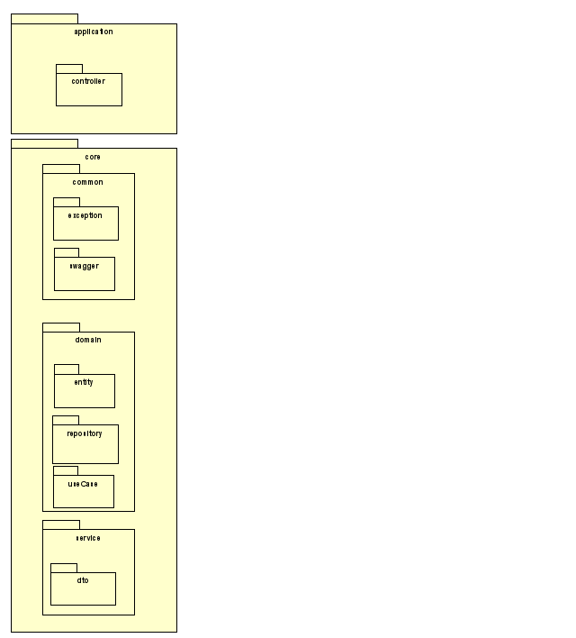

# Sarc API

Este é o projeto de API backend para o SARC feito em Java.

- Framework Spring Boot (com JPA)
- Ferramenta Swagger para a documentação na qual a OpenAPI é baseada.

## Diagrama



- Application:

  - Controller da aplicação. É a camada de entrada da aplicação. É a camada que recebe as requisições HTTP e as delega para a camada de domínio. Também é a camada que retorna as respostas HTTP para o cliente.

- Core:

  - Pasta common. Possui as implementações de exception customizadas e as configurações do Swagger.
  - Classes de domínio da aplicação. São as classes que representam os objetos de negócio da aplicação.
    - Entity: Representam os objetos de negócio da aplicação.
    - Repository: Interfaces de acesso ao banco de dados da aplicação, que são as interfaces que definem os métodos de acesso ao banco de dados que a aplicação deve implementar.
    - Usecase: São as interfaces que definem os métodos que o service deve implementar. Os usecases são implementados na camada de serviço da aplicação.
  - Pasta service. Classes de serviço da aplicação, que são as classes que implementam as regras de negócio da aplicação. Essas classes são responsáveis por implementar os métodos definidos nas interfaces de usecase.
    - DTO: Classes de DTO (Data Transfer Object), que são as classes que representam os objetos de transferência de dados da aplicação. Essas classes são utilizadas para representar os objetos que são recebidos e enviados pela API.

- Infrastructure: não temos uma pasta infrastrucutre, pois o acesso ao banco de dados (implementação do repository) é feito através do JPA. O banco de dados que implementamos temporariamente é mockado.

## Requisitos

- Java 8+ JDK deve estar instalado
- Maven deve estar instalado e configurado no path da aplicação

## Como executar a aplicação

Na raiz do projeto, através de seu Prompt de Commando/Terminal/Console execute o comando

```bash
mvn clean spring-boot:run
```

A aplicação estará disponível através da URL [http://localhost:8080](http://localhost:8080)

## Documentacão técnica da aplicação

A documentação técnica da API está disponível através do OpenAPI/Swagger em [http://localhost:8080/swagger-ui.html](http://localhost:8080/swagger-ui.html)
